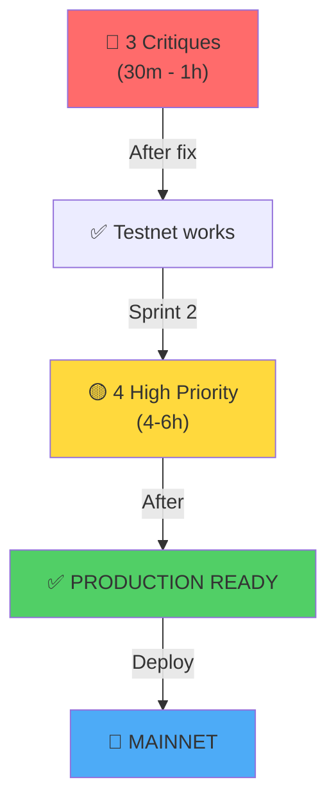

# 🎯 RÉSUMÉ EXECUTIF — MEV-WARS AUDIT

**Date**: 27 Mars 2026  
**Status**: 🟡 **À CORRIGER AVANT PRODUCTION**  
**Temps Estimé**: 10-15 heures

---

## 📊 SCORE GLOBAL: 6.67/10

```
Architecture:        8/10  ✅
Code Quality:        6.5/10 ⚠️
Security:            5/10   🔴
Performance:         7.5/10 ✅
Maintainability:     6/10   ⚠️
Documentation:       7/10   ✅
Web3/Blockchain:     7/10   ✅
─────────────────────────────
OVERALL:            6.67/10  🟡
```

---

## 🔴 3 PROBLÈMES CRITIQUES (Fixer MAINTENANT)

| # | Problème | Fichier | Risque | Temps |
|---|----------|---------|--------|-------|
| **1** | Mock Results Bug | `hooks/useGame.ts` | Utilisateurs trompés | 30m |
| **2** | CRANK_PRIVATE_KEY Exposée | `app/api/crank/route.ts` | Vol de fonds 💰 | 30m |
| **3** | Pas de Rate Limiting | `app/api/crank/route.ts` | DOS Attack | 20m |

**Action**: Fixer ces 3 immédiatement (30m-1h) = Sprint 1

---

## 🟡 4 PROBLÈMES HIGH (Avant mainnet)

| # | Problème | Délicat |
|---|----------|---------|
| **4** | Hardcoded Devnet | `WalletContextProvider.tsx` |
| **5** | Config Disséminée (x3 copies) | Multiple files |
| **6** | Pas de Withdrawal Function | `lib.rs` |
| **7** | PROGRAM_ID Dupliqué (x3) | Multiple files |

**Action**: Sprint 2 (4-6h total)

---

## 🚀 QUICK START FIX GUIDE

### ⚡ (30 min) Issue #1: Mock Results

**Problem**: Fake winners shown before blockchain confirms real ones

**Fix**:
```typescript
// ❌ Current (wrong)
setGameResult(mockWinners); // Show fake

// ✅ Fixed (wait for blockchain)
const realResult = await parseLogsForBlockchainResult();
if (realResult) setGameResult(realResult); // Only show real
```

**File**: [hooks/useGame.ts](hooks/useGame.ts#L80-L150)

---

### 🔒 (30 min) Issue #2: Crank Private Key

**Problem**: .env.local contains `CRANK_PRIVATE_KEY` = leak risk

**Fix 1 - Quick (Recommended)**:
```bash
# Vercel Dashboard:
1. Go to Settings → Environment Variables
2. Add: CRANK_PRIVATE_KEY=xxx (via secure input)
3. Update .gitignore: .env.local
4. Done!
```

**File**: [app/api/crank/route.ts](app/api/crank/route.ts#L11)

---

### 🛡️ (20 min) Issue #3: Add Rate Limiting

**Problem**: Anyone can spam `/api/crank` → DOS

**Fix**:
```bash
npm install @upstash/ratelimit
```

```typescript
// app/api/crank/route.ts
import { Ratelimit } from "@upstash/ratelimit";

const ratelimit = new Ratelimit({
  redis: Redis.fromEnv(),
  limiter: Ratelimit.slidingWindow(10, "60 s"),
});

export async function POST(req: NextRequest) {
  const { success } = await ratelimit.limit(req.ip!);
  if (!success) return NextResponse.json({ error: "Rate limited" }, { status: 429 });
  // ... rest
}
```

Add to `.env`:
```
UPSTASH_REDIS_REST_URL=xxx
UPSTASH_REDIS_REST_TOKEN=xxx
```

**File**: [app/api/crank/route.ts](app/api/crank/route.ts)

---

## 📋 PRIORITÉ FIXE (Ordre d'exécution)



---

## ✅ DONE LIST (Track Your Progress)

### Sprint 1 (30m - 1h)
- [ ] Fix mock results → wait for blockchain
- [ ] Move CRANK_PRIVATE_KEY to Vercel (not .env.local)
- [ ] Add @upstash/ratelimit to POST /api/crank
- [ ] Test on devnet localhost
- **Status after**: Can run on testnet safely

### Sprint 2 (4-6h)
- [ ] Create `config/constants.ts` (centralize ROOMS, PROGRAM_ID, etc)
- [ ] Fix WalletContextProvider → read from env
- [ ] Add withdrawal instruction to smart contract
- [ ] Add /api/admin/withdraw endpoint
- [ ] Replace duplicated PROGRAM_ID references
- **Status after**: ✅ PRODUCTION READY

### Sprint 3 (Optional, 2-3h)
- [ ] Add Error Boundaries
- [ ] Clean up unused imports
- [ ] Improve error logging
- [ ] TypeScript: remove `any` types
- **Status after**: ⭐ OPTIMIZED

---

## 📞 TOP 10 THINGS TO CHECK

1. ✅ [mock results](hooks/useGame.ts#L80-L150) — Wait for blockchain result
2. ✅ [crank private key](app/api/crank/route.ts#L11) — Move to Vercel secrets
3. ✅ [rate limiting](app/api/crank/route.ts) — Add @upstash/ratelimit
4. ✅ [devnet hardcoded](components/WalletContextProvider.tsx#L11) — Use env var
5. ✅ [config scattered](app/page.tsx#L24) — Create centralized constants
6. ✅ [no withdrawal](programs/solana_russian_roulette/src/lib.rs) — Add instruction
7. ✅ [PROGRAM_ID duplicated](utils/anchor.ts#L2) — Import from config
8. ✅ [colors duplicated](hooks/useGame.ts#L11) — Create lib/colors.ts
9. ✅ [console.logs](app/api/crank/route.ts#L40) — Remove for production
10. ✅ [no error boundaries](app/page.tsx) — Add error fallback UI

---

## 🎯 NEXT IMMEDIATE ACTIONS

1. **Read full audit**: [AUDIT_FINAL_COMPLET.md](AUDIT_FINAL_COMPLET.md)

2. **Start Sprint 1 NOW**:
   ```bash
   # Quick test environment
   npm run dev
   
   # Create local .env.local (never commit!)
   NEXT_PUBLIC_RPC_URL=http://localhost:8899
   CRANK_PRIVATE_KEY=... (from local keypair)
   ```

3. **Fix in order**:
   - [ ] Mock results (test on localhost)
   - [ ] Rate limiting (@upstash)
   - [ ] Move CRANK key (Vercel)
   - [ ] Deploy & test on devnet/testnet

4. **Before mainnet**:
   - [ ] Security audit (external firm)
   - [ ] Withdrawal mechanism works
   - [ ] All configs centralized
   - [ ] No `.env.local` leaked

---

## 💡 KEY INSIGHTS

### What's Working Well ✨
- Smart contract is solid (PRNG logic correct)
- Frontend animations are smooth (Framer Motion)
- Good separation: frontend/api/blockchain
- TypeScript strict mode enabled
- Well documented (README, DESIGN_SYSTEM)

### What Needs Fixing 🔧
- **Security**: Private key exposure, no rate limiting
- **UX**: Mock results creating false wins
- **Architecture**: Configuration scattered in 3+ places
- **Incomplete**: No withdrawal mechanism for treasury

### What Could Be Better 🚀
- Remove dead code (commented sections)
- Add monitoring/logging
- Error boundaries for crash prevention
- TypeScript strict enforcement everywhere (remove `any`)

---

## 📞 SUPPORT

**For critical issues only**:
- Issue #1 (Mock results): Focus on blockchain confirmation
- Issue #2 (Private key): Move to Vercel immediately
- Issue #3 (Rate limit): Use @upstash/ratelimit

**For detailed analysis**: See [AUDIT_FINAL_COMPLET.md](AUDIT_FINAL_COMPLET.md)

---

## 🔒 SECURITY CHECKLIST

- [ ] CRANK_PRIVATE_KEY moved to Vercel (not committed)
- [ ] Rate limiting active on /api/crank
- [ ] No `console.log` with sensitive data in production
- [ ] Input validation on all API endpoints
- [ ] Error boundary prevents full crash
- [ ] Withdrawal function tested (if mainnet has treasury)

---

## 🎬 FINAL VERDICT

| Aspect | Status |
|--------|--------|
| **Can Deploy to Devnet?** | ❌ No (fix 3 critiques first) |
| **Can Deploy to Testnet?** | 🟡 After Sprint 1 (with caution) |
| **Can Deploy to Mainnet?** | ❌ No (need Sprint 1 + Sprint 2 + security audit) |
| **Estimated Time to Mainnet** | 10-15 hours (focused work) |

---

**Bon courage! 🚀**

Consultez [AUDIT_FINAL_COMPLET.md](AUDIT_FINAL_COMPLET.md) pour le rapport exhaustif avec code examples.

